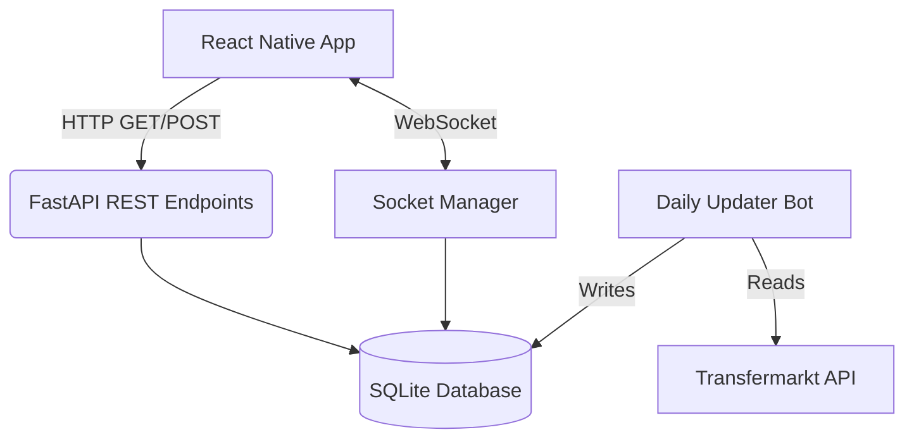

# Genel Mimari (Architecture)

Football TicTacToe, performans ve gerçek zamanlı eşzamanlılığı hedefleyen modern bir mimari ile tasarlanmıştır.

## Sistemin Ana Parçaları

1. **Frontend (React Native & Expo):** 
   - Mobil (iOS ve Android) platformlar için tasarlanmış arayüz.
   - REST API istekleri için `axios` veya standart `fetch`.
   - Gerçek zamanlı Multiplayer oyun için WebSocket (socket.io-client) entegrasyonu.

2. **Backend (FastAPI):**
   - Python tabanlı, asenkron ve son derece hızlı bir API sunucusu.
   - Tüm iş mantığını (oyun kuralları, puan hesaplamaları) barındırır.
   - `socket_manager.py` üzerinden eşzamanlı (concurrent) soket bağlantılarını yönetir. Lobi sistemi ve eşleştirme burada çalışır.

3. **Veritabanı (SQLite & SQLAlchemy):**
   - `football_trivia.db` dosyası üzerinde çalışan tam ilişkisel yapı.
   - 47.000'den fazla futbolcunun kariyer verisini tutar.

4. **Veri Toplama Botu (TMAPI Scraper):**
   - Transfermarkt'ın resmi olmayan JSON API'si üzerinden veri çeker.
   - `full_scraper.py` ile sistemi sıfırdan kurar, `daily_updater.py` ile delta güncellemeleri (yalnızca aktif futbolcular) yapar.

## Mimari Akış Diyagramı

