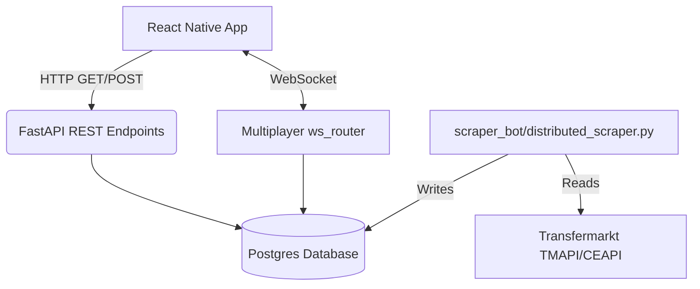

# Genel Mimari (Architecture)

Football TicTacToe, performans ve gerçek zamanlı eşzamanlılığı hedefleyen modern bir mimari ile tasarlanmıştır.

## Sistemin Ana Parçaları

1. **Frontend (React Native & Expo):**
   - Mobil (iOS ve Android) platformlar için tasarlanmış arayüz.
   - REST API istekleri için `axios` veya standart `fetch`.
   - Gerçek zamanlı Multiplayer oyun için WebSocket (`socket.io-client` yerine native WebSocket, bkz. `frontend/services/SocketService.js`) entegrasyonu.

2. **Backend (FastAPI):**
   - Python tabanlı, asenkron ve son derece hızlı bir API sunucusu.
   - Tüm iş mantığını (oyun kuralları, puan hesaplamaları) barındırır.
   - `routers/multiplayer.py` içindeki `ws_router` (`/api/multiplayer/ws`) WebSocket endpoint'ini ve oyun döngüsünü barındırır; oda/bağlantı durumunu ise `socket_manager.py`'deki `ConnectionManager` (`manager`) tekil nesnesi tutar. Lobi sistemi ve eşleştirme bu ikisi birlikte çalışarak yürütülür.

3. **Veritabanı (Postgres & SQLAlchemy):**
   - Production'da **DigitalOcean Postgres** üzerinde çalışan tam ilişkisel yapı (`backend/database.py`, `DATABASE_URL_V2` ortam değişkeni ile yapılandırılır — bkz. [Database Structure](/guide/database)).
   - 47.000'den fazla futbolcunun kariyer verisini tutar.

4. **Veri Toplama Botu (`scraper_bot/`):**
   - Transfermarkt'ın resmi olmayan JSON API'si (TMAPI) ve CEAPI üzerinden veri çeker.
   - `distributed_scraper.py`, verilen bir oyuncu ID aralığını (`--start`/`--end`) tarayarak kulüp/milli takım istatistiklerini ve transfer geçmişini günceller — detaylar için [Scraper Infrastructure](/guide/scraper-api).

## Mimari Akış Diyagramı

::: tip Önbellek uyarısı
`main.py` açılışta takım/oyuncu verisini `TicTacToeEngine` içinde belleğe cache'ler. Veritabanı elle güncellendiğinde değişikliklerin API'ye yansıması için backend'in yeniden başlatılması gerekir.
:::
