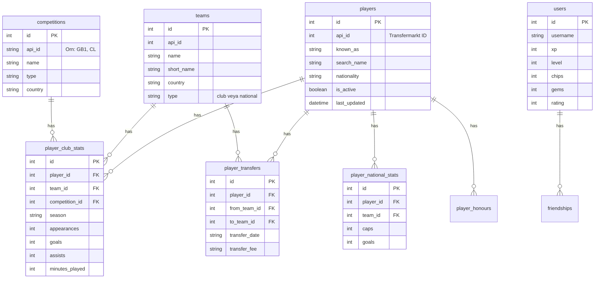

# Veritabanı Yapısı (Database)

Sistemimiz SQLAlchemy ORM (`backend/models.py`) kullanılarak yönetilen ilişkisel bir veritabanına dayanır.

::: warning Tek gerçek kaynak: Postgres
Canlıda çalışan ve `backend/main.py`'nin bağlandığı veritabanı **DigitalOcean üzerindeki Postgres**'tir (`backend/database.py`, `DATABASE_URL_V2` ortam değişkeni). Yerel geliştirme için SQLite de kullanılabilir (aynı `DATABASE_URL_V2` değişkenini `sqlite:///./football_trivia.db` gibi bir değere ayarlayarak), ama iki ortamı **aynı anda karıştırmayın** — hangi script'in hangi veritabanına yazdığını her zaman `.env` dosyasından kontrol edin. Bkz. `backend/.env.example`.
:::

::: tip Önbellek uyarısı
`main.py` açılışta (`startup` event) takım/oyuncu verisini `TicTacToeEngine` içinde belleğe cache'ler. Veritabanında elle değişiklik yaptıktan sonra bu değişikliklerin API'ye yansıması için **backend'in yeniden başlatılması gerekir.**
:::

## ER Diyagramı

## Önemli Tablolar

### 1. Players Tablosu
Tüm oyuncuların temel kimlik bilgileri, aktiflik durumları (`is_active`) ve arama alanları (`known_as`, `search_name`) burada saklanır.

### 2. Player_Club_Stats Tablosu
Oyuncuların kulüp bazında, lig ve sezon kırılımındaki detaylı performansları (`appearances`, `goals`, `assists`, `minutes_played`, `yellow_cards`, `red_cards` vb.). TicTacToe gridindeki "La Liga'da 100 gol atan oyuncu" tarzı zorlu sorular bu tablo üzerinden hesaplanır.

### 3. Player_National_Stats Tablosu
Oyuncuların milli takım kariyerindeki performansları (`caps`, `goals`, `assists`).

### 4. Player_Transfers Tablosu
Oyuncuların kariyerleri boyunca yaptığı tüm transferler (`from_team_id` → `to_team_id`, tarih, bedel). Transfer geçmişinden oyuncu tahmini (Career Guess) modu bu tablo üzerinden çalışır; bir oyuncunun aynı anda hem "Team A" hem de "Team B" ile eşleşmesini (kesişim noktası) bulmak için de kullanılır.

### 5. Player_Honours Tablosu
Oyuncuların kazandığı kupa/şampiyonluklar. Şu an veri girilmemiş, ileride dolacak boş bir tablo.

### 6. Teams Tablosu
`short_name` alanı, kulübün resmi/uzun adındaki ("Futbol Club Barcelona S.A.D." gibi) kurumsal ekleri temizlenmiş, arayüzde gösterilecek kısa adını tutar. Bu alan `backend/scripts/clean_team_names.py` ile doldurulur/güncellenir. Aynı isme sahip birden fazla takım (örn. "Nacional") normaldir — farklı ülkelerden farklı kulüpler, her biri kendi `api_id`'siyle ayrışır; bug değildir.

### 7. Users Tablosu
Ekonomi ve rekabet sistemlerinin (bkz. [Gems & Chips](/guide/systems/economy-gems-chips), [Rank/ELO](/guide/systems/ranking-elo)) durumunu tutar: `chips` (varsayılan 1000), `gems` (varsayılan 20), `rating` (varsayılan 100), `xp`, `level`.

## Veri Hattı (Scraper → Veritabanı)

Veri, `scraper_bot/distributed_scraper.py` tarafından Transfermarkt'ın gayrı resmi API'sinden (TMAPI) çekilip yukarıdaki şemaya yazılır — detaylar için [Scraper Infrastructure](/guide/scraper-api). Scraper'ın hangi veritabanına yazacağı da aynı şekilde `DATABASE_URL_V2` ortam değişkeniyle belirlenir; production'a yazmak için bu değişkenin Postgres bağlantısına set edilmesi gerekir.
