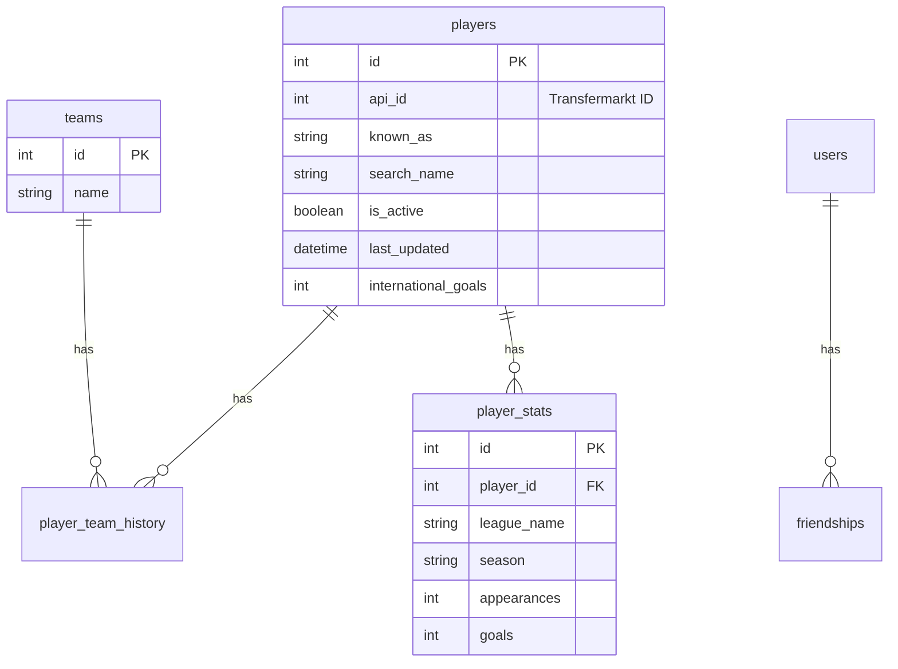

# Veritabanı Yapısı (Database)

Sistemimiz SQLAlchemy ORM kullanılarak yönetilen ilişkisel bir SQLite veritabanına (`football_trivia.db`) dayanır.

## ER Diyagramı

## Önemli Tablolar

### 1. Players Tablosu
Tüm oyuncuların temel kimlik bilgileri, aktiflik durumları (`is_active`) ve Milli Takım performansları burada saklanır.

### 2. Player_Stats Tablosu
Oyuncuların lig ve sezon bazında detaylı performansları. TicTacToe gridindeki "La Liga'da 100 gol atan oyuncu" tarzı zorlu sorular bu tablo üzerinden hesaplanır.

### 3. Player_Team_History Tablosu
Oyuncuların kariyerleri boyunca oynadıkları tüm takımlar. Bir oyuncunun aynı anda hem "Team A" hem de "Team B" ile eşleşmesini (kesişim noktası) bulmak için kullanılır.
